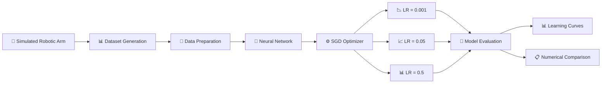
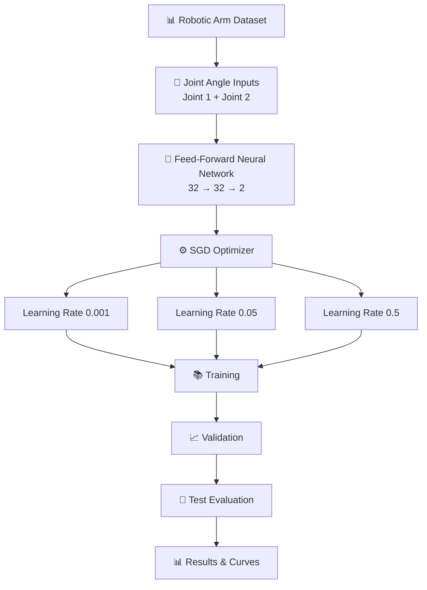

# 🤖 Robotic Arm Learning Rate Analysis

<p align="center">

  

  

  

  

  

  

</p>

<h3 align="center">
  Understanding Learning Rate Behavior Through Robotic-Arm Position Prediction
</h3>

<p align="center">
  A deep-learning experiment that studies how different learning rates affect
  convergence speed, training stability, validation behavior, and prediction
  performance in a simulated robotic-arm model.
</p>

---

## 📌 Project Overview

**Robotic Arm Learning Rate Analysis** is a machine-learning experiment focused on understanding how the **learning rate** influences neural-network training.

The project uses a simulated robotic arm with two joints and two links. A neural network learns the relationship between the two joint angles and the corresponding **end-effector X and Y coordinates**.

Multiple learning rates are evaluated using the **Stochastic Gradient Descent (SGD)** optimizer while keeping the remaining experimental conditions consistent.

The project analyzes:

- Training convergence
- Validation convergence
- Learning stability
- Prediction error
- Test performance
- Effect of small learning rates
- Effect of large learning rates
- Overall learning-rate behavior

The primary experiment compares:

```text
0.001
0.05
0.5
```

The goal is to understand the practical trade-off between **slow convergence, stable learning, and excessive parameter updates**.

---

## 🎯 Problem Statement

The learning rate is one of the most important hyperparameters in neural-network training.

A learning rate that is too small may cause the model to learn very slowly, while a learning rate that is too large may result in unstable or fluctuating training behavior.

For a robotic-arm position prediction problem, this project investigates:

> How does changing the learning rate affect the convergence, stability, and prediction performance of the neural network?

The experiment uses the same dataset, neural-network architecture, optimizer, batch size, and training configuration while changing only the learning rate.

This provides a controlled environment for studying the impact of the learning-rate hyperparameter.

---

## 🎯 Objectives

The main objectives of this project are:

- Understand the role of learning rate in neural-network training.
- Generate a simulated robotic-arm dataset.
- Use forward-kinematics equations to generate end-effector coordinates.
- Train a feed-forward neural network.
- Use SGD as the main optimization algorithm.
- Compare multiple learning rates.
- Analyze training loss curves.
- Analyze validation loss curves.
- Evaluate final test performance.
- Identify slow convergence caused by a small learning rate.
- Observe fluctuations caused by a high learning rate.
- Compare learning-rate performance numerically.
- Understand the relationship between optimization behavior and prediction accuracy.

---

## 🧠 Core Concept

### Learning Rate

The learning rate controls the size of the parameter update made by the optimizer during training.

A simplified gradient-descent update can be represented as:

```text
New Weight = Old Weight - Learning Rate × Gradient
```

Therefore:

```text
Small Learning Rate
        ↓
Small Parameter Updates
        ↓
Slow Learning
        ↓
Slow Convergence
```

while:

```text
Large Learning Rate
        ↓
Large Parameter Updates
        ↓
Faster Movement
        ↓
Possible Fluctuation / Instability
```

A suitable learning rate attempts to provide a balance between:

- Learning speed
- Convergence
- Stability
- Prediction performance

---

## ⚙️ Optimization Algorithm

The main experiment uses the:

**Stochastic Gradient Descent (SGD)** optimizer.

SGD updates the neural-network parameters using the gradients calculated from the training data.

The project evaluates SGD under three different learning rates:

| Learning Rate | Experimental Category |
|---:|---|
| `0.001` | Low |
| `0.05` | Balanced |
| `0.5` | High |

All three experiments use the same model and training setup so that the primary variable being studied is the learning rate.

---

## 🤖 Robotic Arm Model

The project uses a simulated robotic arm containing:

- Two joints
- Two links
- Two input joint angles
- Two end-effector output coordinates

The neural network learns:

```text
Joint Angle 1 ─┐
               ├──> Neural Network ──> End-Effector X
Joint Angle 2 ─┘                       End-Effector Y
```

The target coordinates are generated using **forward-kinematics equations**.

A small amount of measurement noise is included in the generated dataset to make the prediction problem more realistic.

---

## 📊 Dataset

The project uses a simulated dataset containing:

**1000 observations**

### Input Features

```text
Joint_Angle_1
Joint_Angle_2
```

### Target Outputs

```text
End_Effector_X
End_Effector_Y
```

### Dataset Generation

The dataset is generated programmatically using:

- Robotic-arm joint angles
- Forward kinematics
- End-effector coordinate calculations
- Small measurement noise

The generated dataset is stored at:

```text
dataset/robotic_arm_data.csv
```

---

## 🔀 Dataset Split

The dataset is divided into:

| Dataset | Samples |
|---|---:|
| Training | 800 |
| Testing | 200 |

During model training, **20% of the training data** is used for validation.

Therefore, the training workflow can be represented as:

```text
1000 Total Samples
        │
        ├───────────────┐
        │               │
     800 Train       200 Test
        │
        │
     20% Validation
        │
        ├───────────────┐
        │               │
    Training        Validation
```

---

## 🧮 Methodology

The complete experiment follows the pipeline below:

```text
Generate Robotic-Arm Data
          ↓
Save Dataset as CSV
          ↓
Load Dataset
          ↓
Separate Inputs and Targets
          ↓
Train / Test Split
          ↓
Normalize Data
          ↓
Build Neural Network
          ↓
Configure SGD Optimizer
          ↓
Train with Multiple Learning Rates
          ↓
Record Training Loss
          ↓
Record Validation Loss
          ↓
Evaluate Test Dataset
          ↓
Compare Results
          ↓
Analyze Learning Curves
          ↓
Study Learning-Rate Behavior
```

---

## 🧠 Neural Network Architecture

The feed-forward neural network used in the experiment contains two hidden layers.

```text
                    INPUT
                      │
              ┌───────┴───────┐
              │               │
        Joint Angle 1   Joint Angle 2
              │               │
              └───────┬───────┘
                      ↓
              ┌───────────────┐
              │ Hidden Layer 1│
              │   32 Neurons  │
              │     ReLU      │
              └───────────────┘
                      ↓
              ┌───────────────┐
              │ Hidden Layer 2│
              │   32 Neurons  │
              │     ReLU      │
              └───────────────┘
                      ↓
              ┌───────────────┐
              │  Output Layer │
              │   2 Neurons   │
              └───────────────┘
                      ↓
              ┌───────────────┐
              │ End-Effector  │
              │   X and Y     │
              └───────────────┘
```

### Model Configuration

| Parameter | Value |
|---|---|
| Input neurons | 2 |
| Hidden Layer 1 | 32 neurons |
| Hidden Layer 2 | 32 neurons |
| Activation | ReLU |
| Output neurons | 2 |
| Optimizer | SGD |
| Loss Function | Mean Squared Error |
| Metric | Mean Absolute Error |
| Epochs | 100 |
| Batch Size | 32 |
| Validation Split | 20% |

---

## 🔬 Learning Rate Experiments

Three learning rates are compared:

### 1. Learning Rate = `0.001`

The smallest learning rate in the experiment.

Expected behavior:

```text
Small Updates
     ↓
Slow Parameter Movement
     ↓
Slow Convergence
```

The experiment shows that this learning rate makes slower progress and produces considerably higher final error.

---

### 2. Learning Rate = `0.05`

The middle learning rate used in the experiment.

Observed behavior:

```text
Reasonable Updates
       ↓
Fast Learning
       ↓
Stable Convergence
       ↓
Low Prediction Error
```

This learning rate produces the lowest test loss and lowest test MAE among the three tested learning rates.

---

### 3. Learning Rate = `0.5`

The largest learning rate tested.

Observed behavior:

```text
Large Updates
      ↓
Fast Movement
      ↓
Greater Fluctuation
      ↓
Less Stable Training
```

The model still learns, but the training behavior shows greater fluctuation compared with the learning rate of `0.05`.

---

## 📈 Experimental Results

The SGD experiment produced the following results:

| Learning Rate | Final Training Loss | Final Validation Loss | Test Loss | Test MAE |
|---:|---:|---:|---:|---:|
| `0.001` | 0.178542 | 0.169160 | 0.216001 | 0.336934 |
| `0.05` | 0.003007 | 0.003335 | 0.003925 | 0.038864 |
| `0.5` | 0.005495 | 0.003959 | 0.004633 | 0.053636 |

These values are also stored in the project's generated result files.

---

## 📉 Learning Rate = 0.001

The learning rate of `0.001` produces slow progress.

The loss decreases gradually, but the final error remains substantially higher than the other tested learning rates.

### Observed behavior

```text
0.001
 │
 ├── Small parameter updates
 │
 ├── Gradual loss reduction
 │
 └── Slow convergence
```

### Test Performance

```text
Test Loss : 0.216001
Test MAE  : 0.336934
```

---

## 📈 Learning Rate = 0.05

The learning rate of `0.05` produces rapid and stable convergence.

The loss decreases quickly and reaches a low value while maintaining stable training behavior.

### Observed behavior

```text
0.05
 │
 ├── Efficient parameter updates
 │
 ├── Rapid loss reduction
 │
 ├── Stable convergence
 │
 └── Low prediction error
```

### Test Performance

```text
Test Loss : 0.003925
Test MAE  : 0.038864
```

---

## 📊 Learning Rate = 0.5

The learning rate of `0.5` produces greater fluctuations in the learning curves.

The larger parameter updates allow the model to learn quickly, but the training behavior is less stable than the `0.05` experiment.

### Observed behavior

```text
0.5
 │
 ├── Large parameter updates
 │
 ├── Faster movement
 │
 ├── Greater fluctuations
 │
 └── Slightly higher test error
```

### Test Performance

```text
Test Loss : 0.004633
Test MAE  : 0.053636
```

---

## 🏆 Experimental Comparison

The numerical results show the following:

```text
Learning Rate       Test Loss        Test MAE
------------------------------------------------
0.001               0.216001         0.336934
0.05                0.003925         0.038864
0.5                 0.004633         0.053636
```

The experiment demonstrates three different optimization behaviors:

```text
0.001
  ↓
Slow convergence


0.05
  ↓
Fast + stable convergence


0.5
  ↓
Greater fluctuation
```

Based on the experimental results contained in this repository, the learning rate of:

```text
0.05
```

produced the lowest test loss and lowest test MAE among the three tested values.

---

## 📉 Learning Curve Analysis

Learning curves are used to visualize how the model's loss changes throughout training.

The repository contains separate learning and validation curve outputs for the experiments.

### Training Curves

The training curves show how the training loss changes across epochs.

### Validation Curves

The validation curves show how the model performs on validation data during training.

The comparison helps reveal:

- Slow convergence
- Rapid convergence
- Training stability
- Loss fluctuations
- Generalization behavior

---

## 📊 Result Visualization

The project stores generated visualizations inside:

```text
results/
```

Important visualization files include:

```text
results/learning_curves.png
results/validation_curves.png
results/sgd_learning_curves.png
results/sgd_validation_curves.png
```

Additional screenshots are available inside:

```text
screenshots/
```

including:

```text
screenshots/dataset_generation.png
screenshots/sgd_learning_curves.png
screenshots/sgd_results.png
screenshots/sgd_validation_curves.png
```

---

## 🧪 Initial Adam Experiment

The repository also contains an initial learning-rate experiment using the **Adam optimizer**.

This experiment is implemented in:

```text
src/learning_rate_analysis.py
```

It provides an additional learning-rate analysis before the main SGD experiment.

The primary comparative experiment in this project, however, focuses on **SGD** and the learning rates:

```text
0.001
0.05
0.5
```

---

## 🔬 Main SGD Experiment

The main experiment is implemented in:

```text
src/sgd_learning_rate_analysis.py
```

It performs the following operations:

1. Loads the robotic-arm dataset.
2. Separates input and output values.
3. Splits the dataset.
4. Normalizes the data.
5. Creates the neural network.
6. Configures SGD.
7. Trains the model using different learning rates.
8. Records training loss.
9. Records validation loss.
10. Evaluates the test dataset.
11. Generates learning curves.
12. Generates comparison results.
13. Saves the final experimental outputs.

---

## 🗂️ Project Structure

```text
learning-rate-robotic-arm/
│
├── README.md
├── requirements.txt
│
├── dataset/
│   └── robotic_arm_data.csv
│
├── notebooks/
│   └── Learning_Rate_Analysis.ipynb
│
├── src/
│   ├── generate_dataset.py
│   ├── learning_rate_analysis.py
│   └── sgd_learning_rate_analysis.py
│
├── results/
│   ├── final_results.txt
│   ├── learning_curves.png
│   ├── learning_rate_comparison.csv
│   ├── sgd_learning_curves.png
│   ├── sgd_learning_rate_comparison.csv
│   ├── sgd_validation_curves.png
│   └── validation_curves.png
│
└── screenshots/
    ├── dataset_generation.png
    ├── sgd_learning_curves.png
    ├── sgd_results.png
    └── sgd_validation_curves.png
```

---

## 🧩 Component Responsibilities

### `src/generate_dataset.py`

Responsible for generating the simulated robotic-arm dataset using forward-kinematics calculations.

Output:

```text
dataset/robotic_arm_data.csv
```

---

### `src/learning_rate_analysis.py`

Performs the initial learning-rate experiment using the Adam optimizer.

It is useful for exploring learning-rate behavior before the main SGD comparison.

---

### `src/sgd_learning_rate_analysis.py`

Contains the main SGD-based learning-rate experiment.

It compares:

```text
0.001
0.05
0.5
```

and generates the main result files and plots.

---

### `notebooks/Learning_Rate_Analysis.ipynb`

Provides a notebook-based version of the learning-rate analysis workflow.

It can be opened using Jupyter Notebook or JupyterLab.

---

### `dataset/`

Contains the generated robotic-arm dataset.

```text
robotic_arm_data.csv
```

---

### `results/`

Contains the generated experiment results, learning curves, validation curves, comparison CSV files, and final result summary.

---

### `screenshots/`

Contains screenshots documenting the experiment and results.

---

## 🛠️ Technology Stack

### Programming

- Python

### Machine Learning

- TensorFlow
- Keras
- Scikit-learn

### Data Processing

- NumPy
- Pandas

### Visualization

- Matplotlib

### Optimization

- Stochastic Gradient Descent (SGD)
- Adam

### Experimentation

- Jupyter Notebook

---

## 📦 Python Libraries

The project uses the following major libraries:

| Library | Purpose |
|---|---|
| TensorFlow | Deep-learning model development |
| Keras | Neural-network architecture and training |
| NumPy | Numerical computation |
| Pandas | Dataset loading and processing |
| Scikit-learn | Dataset splitting and preprocessing |
| Matplotlib | Learning-curve visualization |

The complete environment specification is available in:

```text
requirements.txt
```

---

## 🚀 Getting Started

### 1. Clone the Repository

```bash
git clone https://github.com/meganathm123-lgtm/learning-rate-robotic-arm.git
```

Move into the project directory:

```bash
cd learning-rate-robotic-arm
```

---

### 2. Create a Virtual Environment

```bash
python -m venv venv
```

Activate it on Windows:

```bash
venv\Scripts\activate
```

On Linux or macOS:

```bash
source venv/bin/activate
```

---

### 3. Install Dependencies

```bash
pip install -r requirements.txt
```

---

## ▶️ Run the Project

### Generate the Dataset

```bash
python src/generate_dataset.py
```

The generated dataset is saved to:

```text
dataset/robotic_arm_data.csv
```

---

### Run the Initial Learning-Rate Experiment

```bash
python src/learning_rate_analysis.py
```

---

### Run the Main SGD Experiment

```bash
python src/sgd_learning_rate_analysis.py
```

The experiment generates learning curves and comparison results inside:

```text
results/
```

---

## 📓 Run the Jupyter Notebook

Start Jupyter Notebook:

```bash
jupyter notebook
```

Then open:

```text
notebooks/Learning_Rate_Analysis.ipynb
```

The notebook provides an interactive environment for exploring the learning-rate experiment.

---

## 📁 Generated Outputs

The main outputs produced by the project include:

### Training Learning Curve

```text
results/learning_curves.png
```

### Validation Learning Curve

```text
results/validation_curves.png
```

### SGD Training Curves

```text
results/sgd_learning_curves.png
```

### SGD Validation Curves

```text
results/sgd_validation_curves.png
```

### Learning-Rate Comparison

```text
results/learning_rate_comparison.csv
```

### SGD Learning-Rate Comparison

```text
results/sgd_learning_rate_comparison.csv
```

### Final Results

```text
results/final_results.txt
```

---

## 🔄 End-to-End Workflow



---

## 🧠 Learning Rate Experiment Architecture



---

## 📐 Forward-Kinematics Learning Problem

The robotic-arm problem can be viewed as a mapping:

```text
Joint Angle 1
       +
Joint Angle 2
       │
       ↓
Forward-Kinematics Relationship
       │
       ↓
End-Effector Position
       │
       ├── X Coordinate
       └── Y Coordinate
```

The neural network learns this relationship from the generated dataset.

---

## 📊 Evaluation Metrics

The project evaluates the trained models using:

### Mean Squared Error

MSE measures the average squared difference between predicted and actual values.

Conceptually:

```text
MSE = Average[(Actual - Predicted)²]
```

A lower MSE indicates smaller squared prediction errors.

---

### Mean Absolute Error

MAE measures the average absolute difference between predicted and actual values.

Conceptually:

```text
MAE = Average[|Actual - Predicted|]
```

A lower MAE indicates smaller average prediction error.

---

## 🔍 What the Experiment Demonstrates

This project provides a practical demonstration of several machine-learning concepts.

### 1. Hyperparameter Sensitivity

Changing only the learning rate can significantly affect training behavior.

### 2. Slow Convergence

A very small learning rate can require more training progress before reaching a low-loss region.

### 3. Training Stability

A large learning rate can produce greater fluctuations because of larger parameter updates.

### 4. Generalization

Validation and test metrics provide additional information beyond training loss.

### 5. Controlled Experimentation

Keeping the remaining training conditions unchanged allows the learning rate to be studied as the main experimental variable.

---

## 💡 Key Findings

The experiment demonstrates:

```text
Learning Rate = 0.001
        ↓
Slow convergence
        ↓
Higher final error


Learning Rate = 0.05
        ↓
Fast convergence
        ↓
Stable learning
        ↓
Lowest observed test error


Learning Rate = 0.5
        ↓
Larger updates
        ↓
Greater fluctuations
        ↓
Slightly higher test error
```

The repository's recorded experiment therefore identifies:

```text
0.05
```

as the selected learning rate for this specific robotic-arm experiment.

This conclusion applies specifically to the dataset, architecture, optimizer, and training configuration used in this project.

---

## 📋 Final Experimental Summary

| Aspect | Result |
|---|---|
| Problem | Robotic-arm end-effector prediction |
| Inputs | Two joint angles |
| Outputs | X and Y coordinates |
| Dataset Size | 1000 observations |
| Training Samples | 800 |
| Testing Samples | 200 |
| Model | Feed-forward neural network |
| Hidden Layers | 2 |
| Hidden Neurons | 32 + 32 |
| Activation | ReLU |
| Main Optimizer | SGD |
| Loss | MSE |
| Metric | MAE |
| Epochs | 100 |
| Batch Size | 32 |
| Learning Rates | 0.001, 0.05, 0.5 |
| Selected Experimental LR | 0.05 |

---

## 🎓 Learning Outcomes

Through this project, the following concepts are explored:

- Neural-network training
- Gradient-based optimization
- Learning-rate selection
- Stochastic Gradient Descent
- Adam optimization
- Forward kinematics
- Robotic-arm modeling
- Dataset generation
- Data normalization
- Training and validation splits
- Loss functions
- Mean Squared Error
- Mean Absolute Error
- Learning curves
- Hyperparameter experimentation
- Model evaluation
- Experimental result analysis

---

## 🔬 Research / Experimentation Perspective

Although this project uses a simulated robotic arm, the experiment demonstrates an important machine-learning workflow:

```text
Define Problem
     ↓
Generate / Collect Data
     ↓
Design Model
     ↓
Choose Optimization Strategy
     ↓
Vary Hyperparameter
     ↓
Train Models
     ↓
Measure Performance
     ↓
Visualize Behavior
     ↓
Compare Results
     ↓
Interpret Findings
```

The project therefore focuses not only on building a neural network, but also on understanding **why training behavior changes when an optimization hyperparameter changes**.

---

## 📸 Experiment Screenshots

The repository contains experiment screenshots under:

```text
screenshots/
```

Available screenshots include:

- Dataset generation
- SGD learning curves
- SGD results
- SGD validation curves

These provide visual documentation of the experimental workflow and results.

---

## 📊 Result Files

The numerical comparison files generated by the experiments are stored in:

```text
results/
```

Important files include:

```text
learning_rate_comparison.csv
sgd_learning_rate_comparison.csv
final_results.txt
```

These files provide machine-readable and summarized versions of the experiment results.

---

## 🧪 Reproducibility

The project is structured so that the dataset-generation and training workflow can be reproduced from the source files.

The primary reproducibility sequence is:

```bash
python src/generate_dataset.py
python src/sgd_learning_rate_analysis.py
```

The resulting outputs are stored under:

```text
results/
```

The repository also contains the generated dataset and experimental outputs used for documenting the results.

---

## ⚠️ Scope and Limitations

This project is a **simulated robotic-arm machine-learning experiment**.

It focuses on:

- Learning-rate analysis
- Neural-network training
- End-effector position prediction
- Optimization behavior

It does not represent a physical robotic arm control system.

The experiment does not claim to directly control physical robot hardware.

The results are specific to the simulated dataset and neural-network configuration used in the project.

---

## 🚀 Possible Future Extensions

Potential directions for extending the experiment include:

- Testing additional learning rates.
- Testing learning-rate schedules.
- Comparing SGD with Adam and other optimizers.
- Testing different neural-network architectures.
- Adding additional robotic-arm joints.
- Exploring deeper networks.
- Comparing different activation functions.
- Studying batch-size effects.
- Studying optimizer momentum.
- Adding more realistic sensor noise.
- Extending the dataset.
- Comparing additional evaluation metrics.
- Exploring physical robotic-arm deployment.

---

## 🧠 Why This Project Matters

Learning rate selection is a fundamental part of deep-learning optimization.

A model architecture alone does not determine training behavior. Optimization parameters can strongly influence:

- How quickly the model learns
- How stable the training process is
- How the loss changes over time
- How well the model performs on unseen data

By using a robotic-arm prediction problem, this project connects a fundamental deep-learning concept with a robotics-oriented application.

---

## 🛠️ Project Development Approach

The project follows an experimental approach:

```text
Experiment
    ↓
Observe
    ↓
Measure
    ↓
Visualize
    ↓
Compare
    ↓
Interpret
```

Instead of changing multiple variables simultaneously, the main experiment keeps the model configuration consistent while changing the learning rate.

This makes it easier to study the effect of the selected hyperparameter.

---

## 📚 Documentation and Experiment Assets

The repository includes:

```text
Source Code
    ↓
Dataset
    ↓
Jupyter Notebook
    ↓
Training Results
    ↓
Learning Curves
    ↓
Comparison CSV Files
    ↓
Screenshots
    ↓
Final Experimental Summary
```

This provides both the implementation and supporting experimental evidence in the same repository.

---

## 👨‍💻 Developer

<p align="center">

<strong>Meganath M</strong>

</p>

<p align="center">
CSE (AI & ML) • AI/ML Developer • Full-Stack Builder • Robotics Explorer
</p>

<p align="center">

<a href="https://github.com/meganathm123-lgtm">

</a>

<a href="https://www.linkedin.com/in/meganathmadurai12">

</a>

</p>

---

## 📄 License

This project includes a `LICENSE` file in the repository.

Please refer to the repository license for the applicable usage and distribution terms.

---

<p align="center">

### 🤖 Learn • Experiment • Analyze • Improve

Built as a machine-learning and robotics experimentation project.

</p>

<p align="center">
⭐ If you find the project useful, consider giving the repository a star.
</p>
